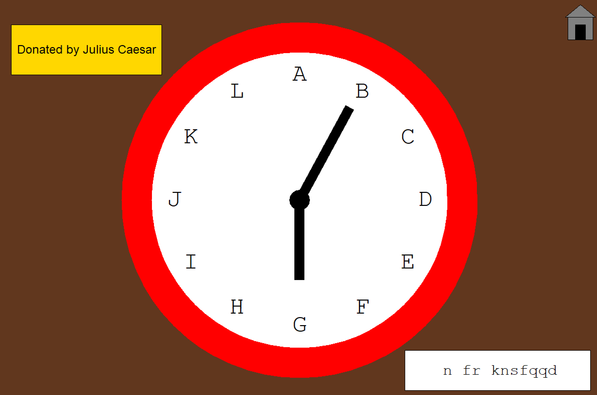
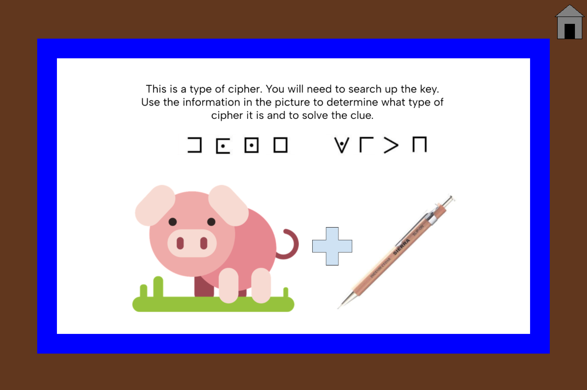
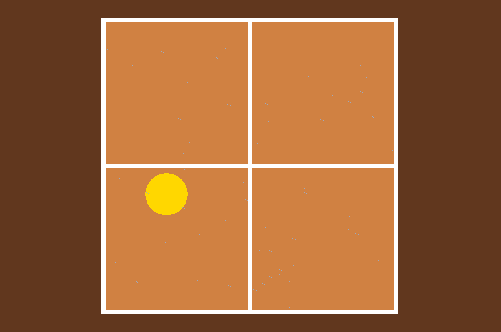

# escape-room
An escape room game created using Python Graphics during my first programming class, Computer Science Inquiries (CSI),
in sophomore year of high school (2023). 
This GitHub page was made in 2025. 

## Run this project!
Run the main.py script and let the game begin.

## How to play
The user must first enter the house, then click on various objects within the house to gain part of the phrase required to 
exit the escape room. Unlocking these clues require users to call upon their knowledge of various types of ciphers.

When they think they have all the clues they need, they can enter the passkey to escape by clicking on the lock object.

## Answers
If you are curious, and looking for answers on how to get through the game, they are as follows: 

### Clock
The clock uses a Ceaser cipher to decrypt the message on the bottom right corner. 
To decrypt the code, you must set the letter that the short hand is on to the letter that 
the long hand is on. This means the letter G corresponds with the letter B. 

After decryption, the message is "I am finally"

### Picture
The picture uses a pigpen cipher. The code can be found online and is used to decrypt the symbols on the right. 
After decryption, the message is "done with".

### TV
The blinking on the TV corresponds to a morse code pattern. After decoding the blinks, you end up with "CSI".

### Fireplace
After clicking on the fire, it slowly dies out, leaving the user with the last piece of the puzzle: an exclamation point. 

### Window
The above clues are already in the correct order. The window tells users what the correct order of clues is. 
After clicking on the window, there is a little animation that leads to a rainbow with the colors out of order: 
red, blue, black, orange. These colors correspond to the color of each object with a clue and tell the user 
the order of the clues for the final passkey. 

### Phone
The phone function can give the user clues to the meaning of the clues. The user must type the corresponding
number sequence for the name of the object they are stuck on (which can be determined by the keypad on the phone)
in the python terminal.
* 89: TV
* 25625: Clock
* 946369: Window
* 7428873: Picture
* 5625: Lock
* 3473 or 347375223: Fireplace

### Lock
<<<<<<< Updated upstream
To finally exit the escape room, enter the passkey "i am finally done with csi!" in the python terminal. 

